

# proyecto-formatos-02

## Desarrollo de un Sistema de Gestión de Tareas y Notificaciones Personalizadas para la Mejora de la Productividad

**INTEGRANTES**  
**Erick Ayma**  
**Fabiola Poma**  
**Dylan Tapia**

---

## Descripción del Proyecto

---

## 💻 Tecnologías Utilizadas
  
  
  
  
  

---

## Funcionalidades Principales.

## Package :https://packagist.org/packages/thegoat/project?query=thegoat%2Fproject

## Diagrama de casos de uso

## Diagrama de Arquitectura
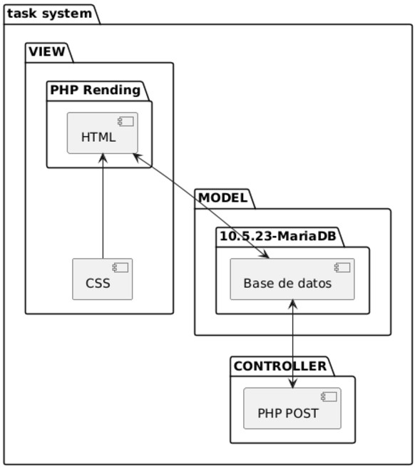

## Diagrama de clases
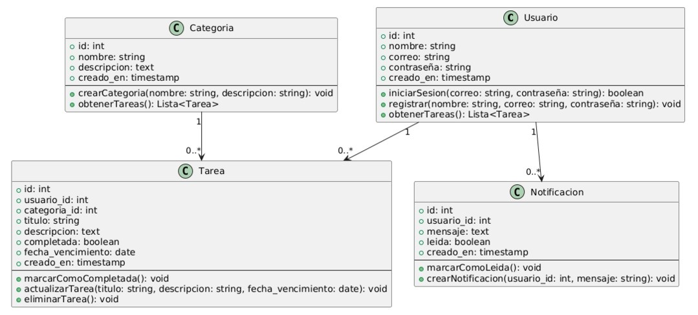

## Diagrama de paquetes
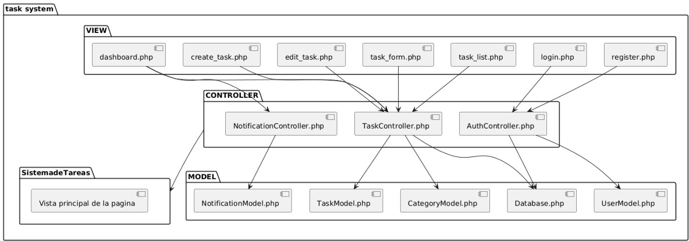

## Diagrama de despliegue
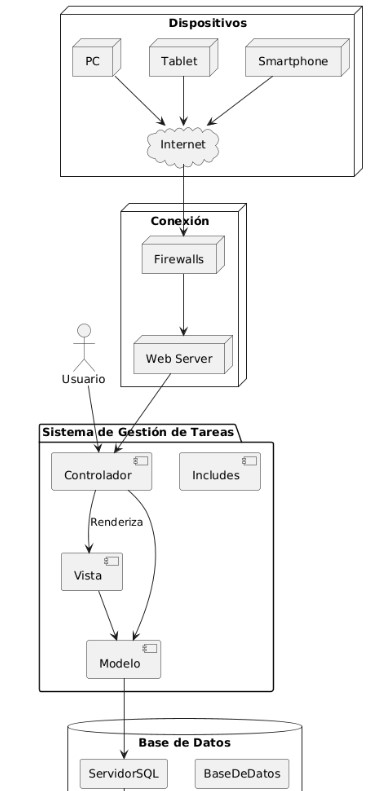

## Diagrama de Secuencia
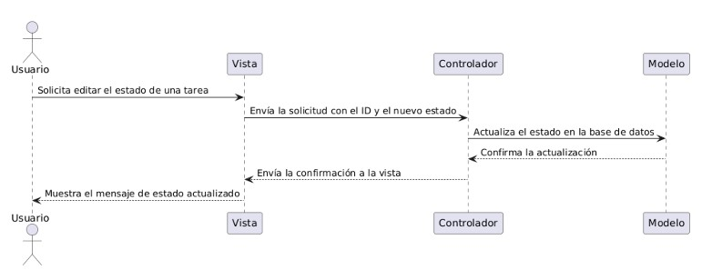
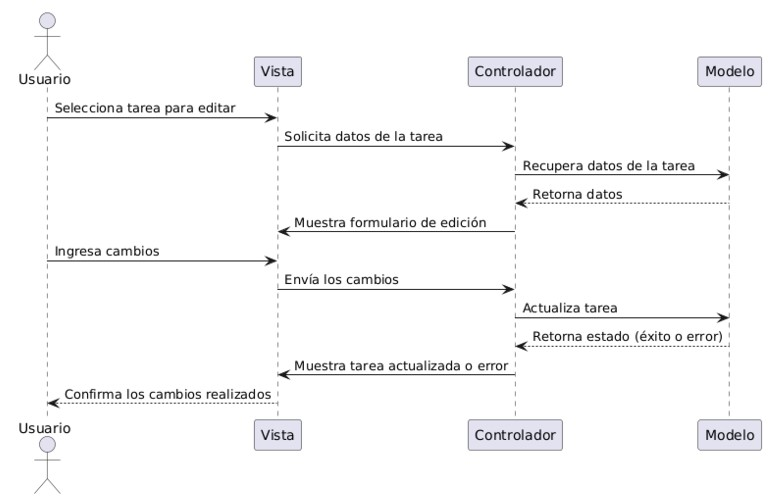
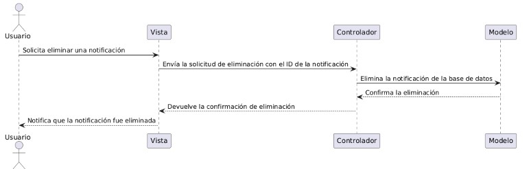

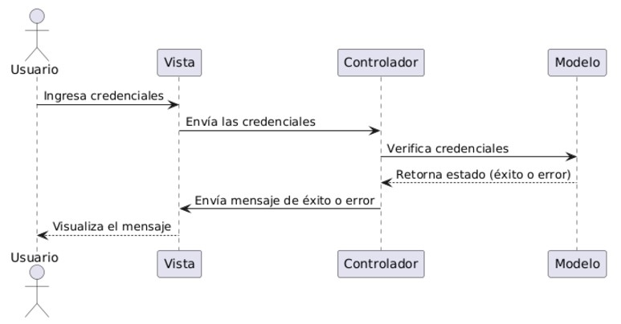

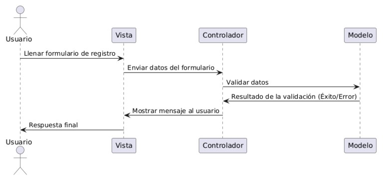
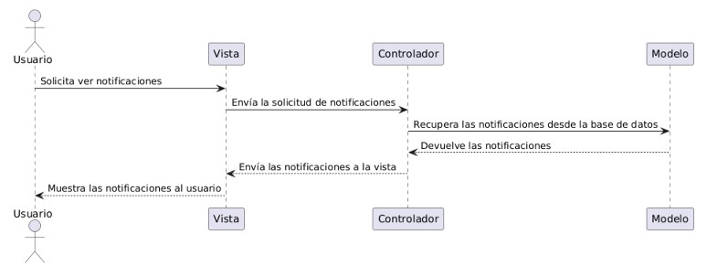
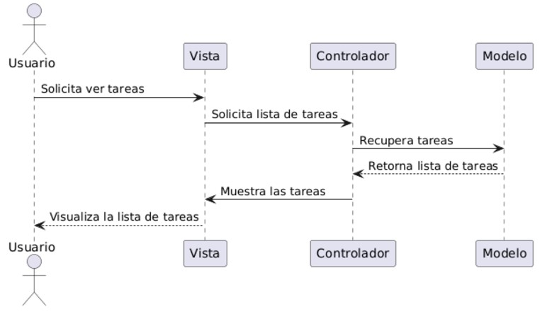

